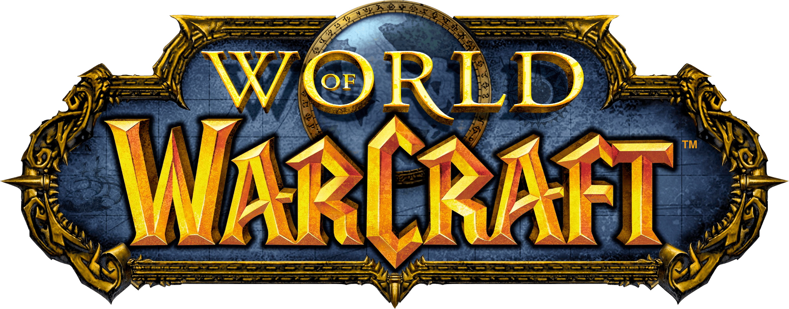

# Introducción a *World of Warcraft*

*World of Warcraft* (WoW) es un MMORPG (juego de rol multijugador masivo en línea) desarrollado por Blizzard Entertainment. Lanzado en 2004, el juego transporta a los jugadores al mundo fantástico de **Azeroth**, un universo poblado por razas, reinos, guerras y magia ancestral.

## El universo de Azeroth

El mundo de *World of Warcraft* está compuesto por varios continentes —Kalimdor, los Reinos del Este, Terrallende y más adelante Rasganorte—, cada uno con su propia historia, ecosistema y conflictos. Los jugadores pueden elegir entre **dos facciones principales**:

- **La Alianza:** compuesta por razas como humanos, enanos, elfos de la noche y draenei.  
- **La Horda:** integrada por orcos, trols, tauren, no-muertos y elfos de sangre.

Cada facción tiene su propio estilo, cultura y objetivos, lo que crea una rivalidad constante que atraviesa toda la narrativa del juego.

## Clases y progresión

Los jugadores crean su propio héroe, eligiendo una **raza** y una **clase**, como guerrero, mago, cazador o sacerdote. A medida que ganan experiencia, suben de nivel, adquieren nuevas habilidades y equipo, y participan en misiones, mazmorras y batallas contra otros jugadores.

## Expansiones y evolución del juego

Desde su lanzamiento, *World of Warcraft* ha recibido varias expansiones que amplían su historia y contenido.  
Tras el éxito de *The Burning Crusade* (2007), Blizzard lanzó una de las expansiones más queridas por los fans:

 **Wrath of the Lich King** (2008)  
 Una nueva era oscura se aproxima desde el gélido norte…
