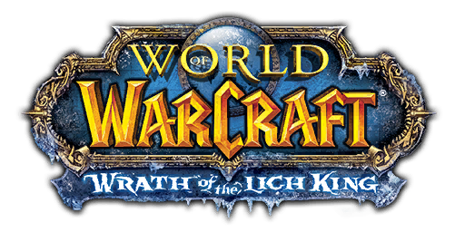
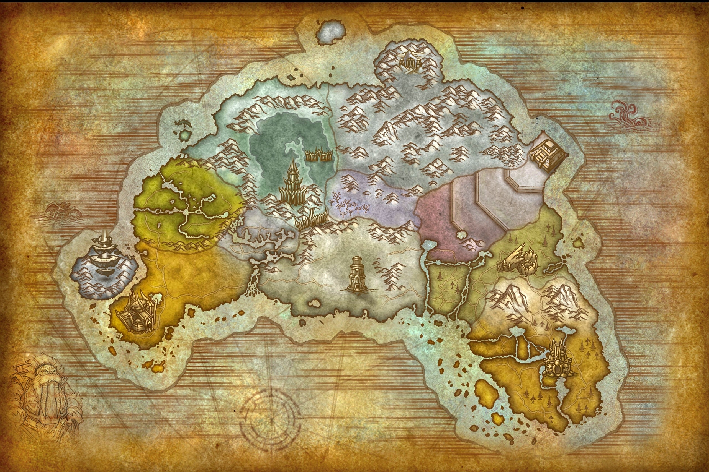
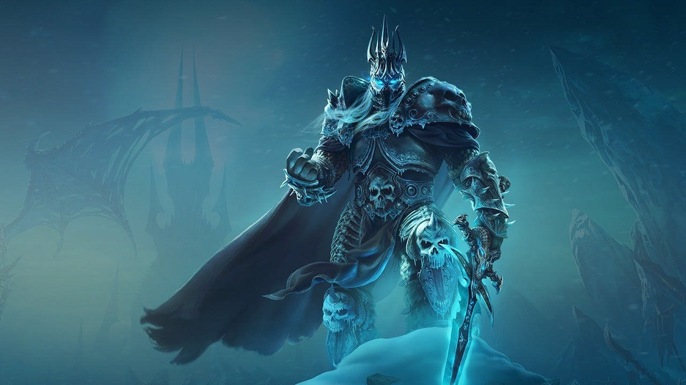

<body style="background-color:#1e1e2f; color:#ffffff;">
</body>
# *Wrath of the Lich King* — La Ira del Rey Exánime

Lanzada en **noviembre de 2008**, *Wrath of the Lich King* es la segunda expansión de *World of Warcraft*. Esta entrega lleva a los jugadores a **Rasganorte**, un continente helado dominado por **Arthas Menethil**, el temido *Rey Exánime*.
<a href="https://www.youtube.com/watch?v=tyNgbHX9p2U">Tráiler Cinemático Wrath of the Lich King</a>  
<a href="https://www.youtube.com/watch?v=2AXpIG7uyFE&list=RD2AXpIG7uyFE&start_radio=1">De las mejores canciones que tiene la banda sonora de esta expansión</a>  
## La historia

Después de los sucesos de *The Burning Crusade*, el equilibrio del mundo vuelve a estar amenazado.  
Arthas, antiguo príncipe de Lordaeron, fue corrompido por la espada rúnica **Frostmourne** y se fusionó con el espíritu del Rey Exánime, convirtiéndose en uno de los villanos más icónicos del universo de Warcraft.

Su ejército de muertos vivientes, el **Azote**, busca arrasar con toda forma de vida en Azeroth. Las facciones de la Alianza y la Horda viajan a Rasganorte para detenerlo y poner fin a su reinado helado.

## Zonas destacadas de Rasganorte

- **Fiordo Aquilonal:** el primer punto de invasión hacia el continente.  
- **Tundra Boreal:** zona costera donde la guerra entre facciones se intensifica.  
- **Corona de Hielo:** el territorio del Rey Exánime, coronado por la Ciudadela de la Corona de Hielo.  
- **Bosque Canto de Cristal, Zul'Drak y Toravon:** regiones que muestran la lucha entre la vida y el Azote.

## Novedades principales

- **Nueva clase heroica:** el **Caballero de la Muerte**, el primer héroe inicial de nivel 55.  
- **Nuevas profesiones y mazmorras:** como las forjas de Ulduar o la épica *Ciudadela de la Corona de Hielo*.  
- **Sistema de logros:** se introducen los logros, que recompensan la exploración y la dedicación.  
- **Monturas voladoras en Rasganorte:** una de las mejoras más esperadas.  

## Legado

*Wrath of the Lich King* es considerada por muchos jugadores como la **época dorada de WoW**, gracias a su equilibrio entre narrativa, dificultad y contenido.  
La caída del Rey Exánime marcó el fin de una era, dejando una huella imborrable en la historia del juego y en la comunidad.
